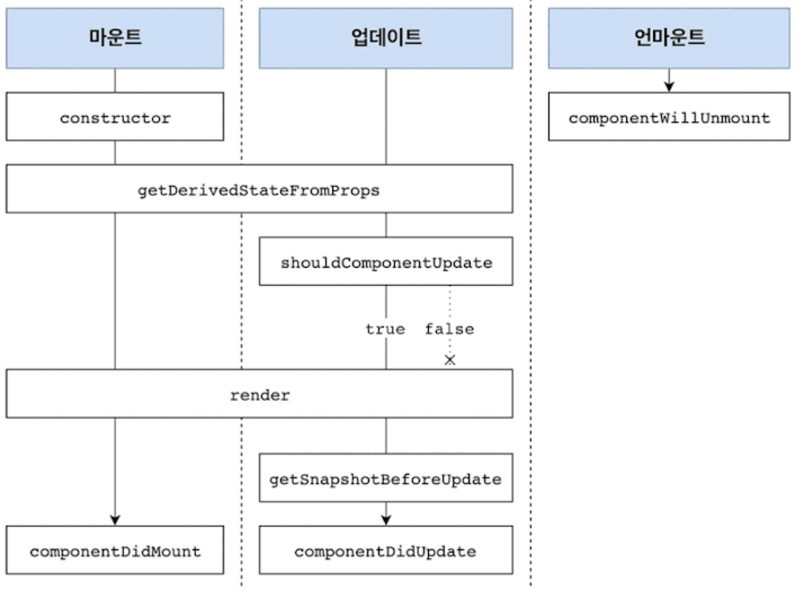

## 📆 2021-02-16

### 📝 모던자바스크립트 튜토리얼

###

- [x] 자바스크립트 소개
- [ ] 자바스크립트 기본 (진행중)
      2.13 while과 for 반복문까지 공부 완료

---

### 📖 리액트를 다루는 기술

###

#### 컴포넌트의 라이프사이클

      Mount → Update → Unmount

###

1. Mount : 페이지에 컴포넌트가 나타남

#####

2.  Update : 컴포넌트 정보를 업데이트

            - props가 바뀔 때
            - state가 바뀔 때
            - 부모 컴포넌트가 리렌더링 될때
            - this.forceUpdate로 강제로 렌더링을 트리거할 때

#####

3. Unmount : 페이지에서 컴포넌트가 사라짐

###

❗️ **라이프사이클 메서드는 _<u>클래스형 컴포넌트</u>_ 에서만 사용할 수 있음**
(함수형 컴포넌트에서는 hooks 기능을 활용)

###

#### 라이프사이클 메서드의 흐름

